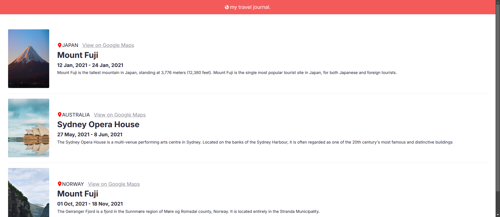
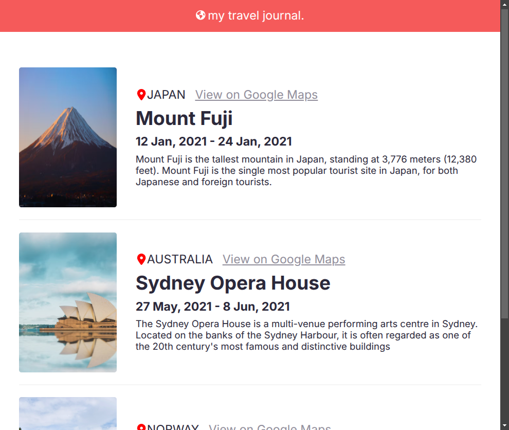

# 🌊 Travel Journal


## Table of Contents


- [Table of Contents](#table-of-contents)

- [👋Introduction](#introduction)

- [🌟Features](#features)

- [🚀 Live Project](#-live-project)

- [📸 Screenshots](#-screenshots)

- [💡Technique Skills](#Technique-skills)

- [🛠️Technologies Used](#️technologies-used)

- [🏁Getting Started](#getting-started)

- [⬇️Installation](#️installation)

- [🔧Usage](#usage)

- [📄License](#license)

  

## 👋Introduction

  
Travel Journal application built with React, It displays a list of journeys with details about each trip, including images, country names, landmarks, and descriptions. The project uses FontAwesome for icons and includes a basic CSS file for styling.

  

## 🌟Features

- Header Component: Displays a header with a title and an icon.
- Journey List: Dynamically renders a list of journeys from a data source.
- Reusable Components: Uses reusable React components for the header and journey items.
- Styling: Includes a CSS file for styling the application.
- Data Mapping: Maps over an array of journey objects to generate components.

  

## 🚀 Live project

  

[🌊 Travel Journal](https://travel-journal-lime-one.vercel.app/)

  

## 📸 Screenshots

  






## 💡Technique Skills
- **DOM and Event Handling**
i handled DOM updates through React's JSX syntax.

 ```
  return (
    <>
      <Header />
      <div className="main">
      {Journys}
      </div>
    </>
  );
```
- **TypeScript**
i used TypeScript for type safety
```
type items={
  country: string,
  img:string,
  TouristLandmark: string,
  time: string,
  desc: string,
}[]
```

- **Reusable Components**
created reusable components like Journy.
```
import { FontAwesomeIcon } from "@fortawesome/react-fontawesome";
import { faMapMarkerAlt } from "@fortawesome/free-solid-svg-icons";
type JournyProps ={
  [key:string]:any;
}
export default function Journy(props:JournyProps) {
  return (
    <div className="journy">
      
      <div className="content">
        <div className="text">
          <FontAwesomeIcon icon={faMapMarkerAlt} />
          <span className="country">{props.country}</span>
          <a className="maps" href="#">
            View on Google Maps
          </a>
        </div>
        <h1 className="Landmark">{props.TouristLandmark}</h1>
        <p className="time">{props.time}</p>
        <p className="desc">{props.desc}</p>
      </div>
    </div>
  );
}

```
- **Array maping**
 used array methods like  map.
 ```
let Journys = journal.map((trip) => {
    return <Journy key={trip.country} {...trip} />;
  });
 ```
- **FontAwesome**
Integrates FontAwesome for icons in the header
```
import { FontAwesomeIcon } from "@fortawesome/react-fontawesome";
import { faGlobeAmericas } from "@fortawesome/free-solid-svg-icons";
```
## 🛠️Technologies Used

  

The Travel Journal project utilizes the following technologies:

  

-    &nbsp;  &nbsp;[Html](https://html.com/)

-    &nbsp;  &nbsp;[Css](https://www.w3.org/Style/CSS/Overview.en.html)

-    &nbsp;  &nbsp;[React](https://reactjs.org/)

-    &nbsp;  &nbsp;[TypeScript](https://www.typescriptlang.org/)

  

## 🏁Getting Started

  

To set up the Travel Journal project locally, follow the instructions below.

  

## ⬇️Installation

  

To set up the project locally, follow these steps:

  

1. Clone the repository:

  

```bash

git clone https://github.com/Abdelrahman-wahed/travel-journal.git

```

  

2. Navigate to the project directory:

```bash

cd travel-journal

```

  

3. Install the required dependencies:

  

```bash

npm install

```

  

## 🔧Usage

  

1. Run the development server:

  

```bash

npm run dev

```

  

2. Open your browser and go to `http://localhost:5173/` to view the application.

  

## License

  

This project is licensed under the MIT License - see the [LICENSE](LICENSE.md) file for details.